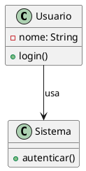

# 📋 README - Como Utilizar e Visualizar PlantUML (.puml)

## 🌟 Introdução
Este guia explica como **visualizar e editar** arquivos `.puml` (PlantUML) no IntelliJ IDEA ou outras ferramentas. O PlantUML é uma linguagem para criação de diagramas UML através de código.

Leia a documentação oficial: [plantuml.com](https://plantuml.com/)

---


## 🛠️ Pré-requisitos

1. ☕ **Java (JRE)** – Necessário para interpretar e renderizar arquivos `.puml`.  
   - 🔗 Download: [https://www.oracle.com/java/technologies/javase-downloads.html](https://www.oracle.com/java/technologies/javase-downloads.html)

2. 🖼️ **Graphviz** – Recomendado para renderizar diagramas mais avançados (ex: diagramas de Gantt, WBS, etc.).  
   - 🔗 Download: [https://graphviz.org/download/](https://graphviz.org/download/)

---

### 🐧 Instalação no Linux (Debian/Ubuntu)

```bash
# Instalar Java Runtime Environment
sudo apt update
sudo apt install default-jre

# Instalar Graphviz
sudo apt install graphviz
```

> 💡 Dica: Verifique se a instalação foi bem-sucedida com os comandos:
```bash
java -version
dot -V
```
---

## 🔌 Instalação do Plugin no IntelliJ
1. Abra o IntelliJ e vá em:
   ```
   File > Settings > Plugins
   ```
2. Busque por **"PlantUML"** e instale o plugin oficial.
3. Reinicie o IDE.

---


## 🔌 Configurando no VS Code
1. Abra o VS Code e vá até a aba de extensões (Ctrl+Shift+X):
2. Busque por **"PlantUML"** e instale o plugin oficial.
---


## 📂 Como Visualizar Arquivos .puml
1. **Abra um arquivo `.puml`** no IntelliJ.
2. **Visualização automática**:  
   - O diagrama será renderizado em tempo real em um painel à direita.

3. **Atalhos úteis**:
   - `Ctrl + Shift + A` > "Reload PlantUML Diagram" para atualizar.
   - `Ctrl + Alt + L` para formatar o código.

---

## ✏️ Editando Diagramas
### Sintaxe Básica (Exemplo):


### Tipos de Diagramas Suportados:
- **Classes** (como no exemplo acima)
- **Casos de Uso**, **Sequência**, **Fluxo**, **Componentes**, etc.  
  (Basta usar `@startuml` + `@enduml` com a sintaxe adequada).

---

## 🔄 Exportando Diagramas
1. **Para PNG/SVG**:  
   - Clique com o botão direito no preview do diagrama.
   - Selecione **"Export Diagram"** e escolha o formato.

2. **Via Linha de Comando** (opcional):
   ```bash
   java -jar plantuml.jar arquivo.puml
   ```
   *(Requer [Java](https://java.com) e o [JAR do PlantUML](https://plantuml.com/download))*

---

## 🌐 Outras Ferramentas
1. **Visual Studio Code**:  
   - Instale a extensão **"PlantUML"** (por jebbs).  
   - Atalho: `Alt + D` para visualizar.

2. **Online (Web)**:  
   - [PlantUML Web Server](https://www.plantuml.com/plantuml/uml/)

---

## 💡 Dicas
- Use **`skinparam`** para personalizar cores e layouts:
  ```plantuml
  skinparam classBackgroundColor #F9F9F9
  skinparam classFontSize 14
  ```
- **Documentação Completa**: [plantuml.com](https://plantuml.com/)

---

## ❓ Suporte
Problemas? Consulte:
- [Documentação do Plugin](https://plugins.jetbrains.com/plugin/7017-plantuml-integration)
- [Fórum PlantUML](https://forum.plantuml.net/)

---
